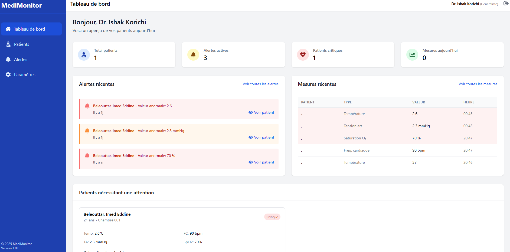
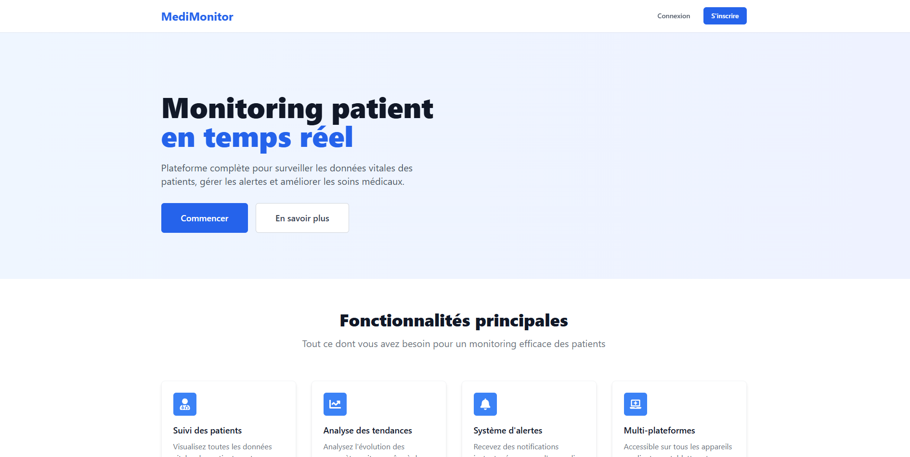
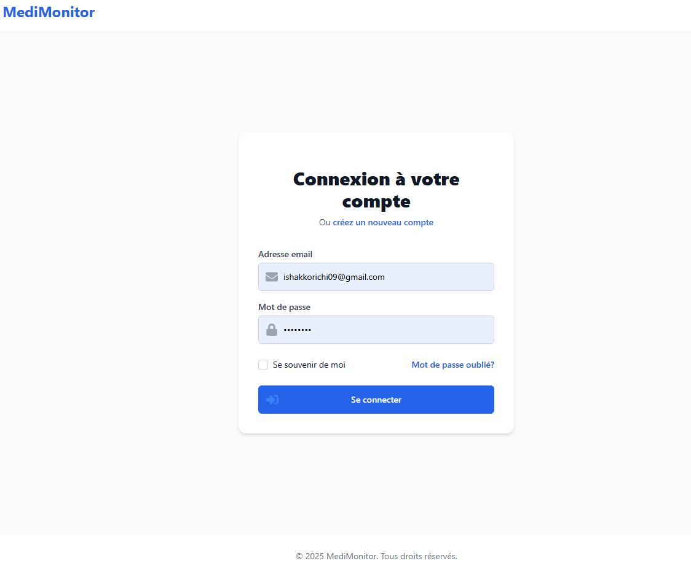
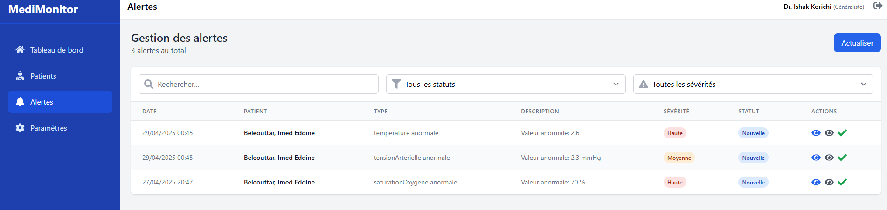

# MediMonitor - Application de Suivi Médical en Temps Réel

[](https://nextjs.org/)
[](https://www.mongodb.com/)
[](https://tailwindcss.com/)
[](https://reactjs.org/)

MediMonitor est une application web complète de suivi médical en temps réel, conçue pour les établissements de santé et le suivi à domicile. Cette plateforme permet aux professionnels de santé de surveiller efficacement les constantes vitales des patients, de gérer les alertes médicales et d'analyser l'évolution des données de santé.



## 📋 Fonctionnalités

- **Suivi en temps réel des patients**
  - Température, fréquence cardiaque, saturation en oxygène, tension artérielle, etc.
  - Visualisation graphique de l'évolution des constantes
  - Vue d'ensemble des patients critiques

- **Système d'alertes intelligent**
  - Détection automatique des anomalies dans les constantes vitales
  - Classification des alertes par niveaux de sévérité (basse, moyenne, haute, critique)
  - Gestion du statut des alertes (nouvelle, vue, résolue)

- **Gestion complète des patients**
  - Création et édition des dossiers patients
  - Suivi des pathologies et des médicaments
  - Historique détaillé des mesures

- **Interface utilisateur intuitive**
  - Tableau de bord personnalisé
  - Navigation simplifiée
  - Design responsive adapté à tous les appareils

## 🛠️ Technologies utilisées

- **Frontend**
  - Next.js (React)
  - TailwindCSS pour le design
  - Recharts pour les graphiques
  - React Icons pour l'iconographie

- **Backend**
  - API Routes de Next.js
  - MongoDB avec Mongoose pour la persistance des données
  - JWT pour l'authentification

- **Architecture**
  - Architecture modulaire et évolutive
  - Modèle de données NoSQL optimisé pour les soins de santé
  - Système de middleware pour la sécurité

## 🚀 Installation et démarrage

### Prérequis

- Node.js (version 14.x ou supérieure)
- MongoDB (locale ou Atlas)
- Npm ou Yarn

### Installation

1. Cloner le dépôt
   ```bash
   git clone https://github.com/votre-utilisateur/medimonitor.git
   cd medimonitor
   ```

2. Installer les dépendances
   ```bash
   npm install
   # ou
   yarn install
   ```

3. Configurer les variables d'environnement
   Créez un fichier `.env.local` à la racine du projet avec les variables suivantes :
   ```
   MONGODB_URI=votre_uri_mongodb
   JWT_SECRET=votre_clé_secrète_jwt
   ```

4. Lancer le serveur de développement
   ```bash
   npm run dev
   # ou
   yarn dev
   ```

5. Ouvrir [http://localhost:3000](http://localhost:3000) dans votre navigateur

## 📁 Structure du projet

```
medimonitor/
├── components/        # Composants React réutilisables
│   ├── dashboard/     # Composants du tableau de bord
│   ├── layout/        # Composants de mise en page
│   └── patients/      # Composants liés aux patients
├── lib/               # Bibliothèques et utilitaires
│   ├── middleware/    # Middleware d'authentification
│   ├── models/        # Modèles Mongoose
│   └── mongodb.js     # Configuration de la connexion MongoDB
├── pages/             # Pages de l'application
│   ├── api/           # API Routes Next.js
│   ├── patients/      # Pages de gestion des patients
│   └── ...            # Autres pages
├── public/            # Ressources statiques
└── styles/            # Styles globaux
```

## 🔒 Sécurité

L'application implémente plusieurs mesures de sécurité :
- Authentification par JWT
- Hachage des mots de passe avec bcrypt
- Middleware d'authentification pour sécuriser les routes API
- Validation des données côté serveur

## 📱 Captures d'écran

### Page d'accueil


### Tableau de bord


### Écran de connexion


### Gestion des alertes


## 📚 Documentation API

L'API REST de MediMonitor est structurée autour des ressources suivantes :

- `/api/patients` - Gestion des patients
- `/api/measurements` - Gestion des mesures
- `/api/alerts` - Gestion des alertes
- `/api/auth` - Authentification

Pour une documentation complète de l'API, consultez le [Wiki du projet](lien_vers_wiki).

## 📝 License

Ce projet est sous licence MIT. Voir le fichier [LICENSE](LICENSE) pour plus de détails.

## 👥 Contribution

Les contributions sont les bienvenues ! N'hésitez pas à soumettre une pull request ou à ouvrir une issue.

## 📧 Contact

Pour toute question ou suggestion, veuillez contacter [votre-email@domaine.com](mailto:votre-email@domaine.com).
